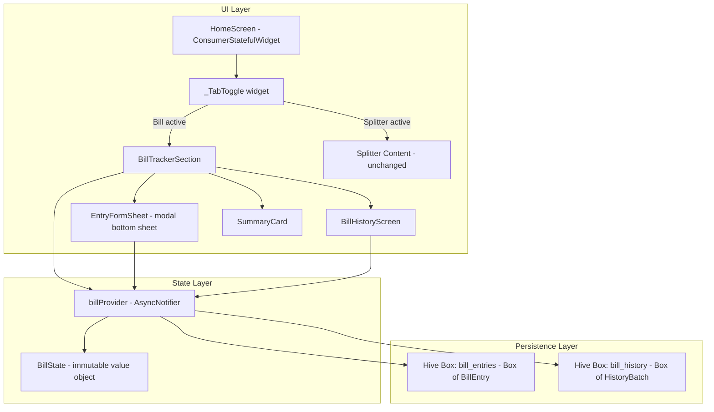
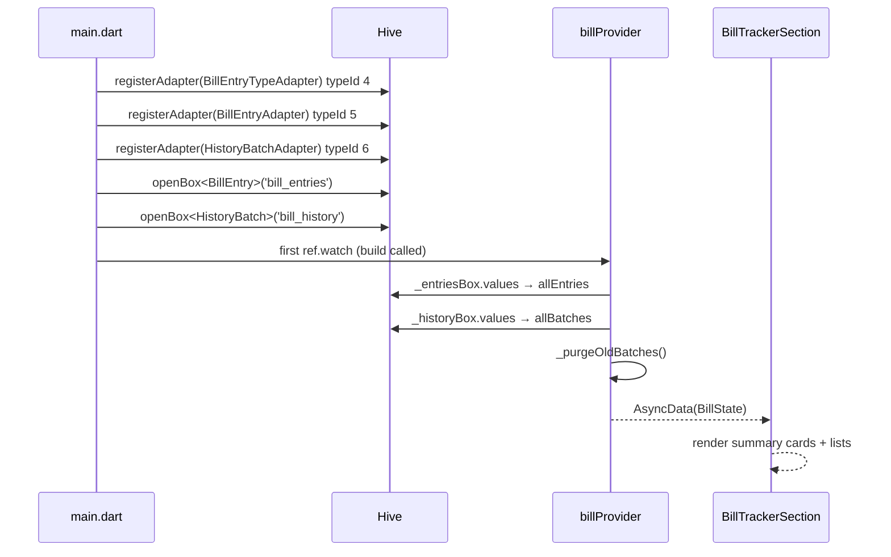
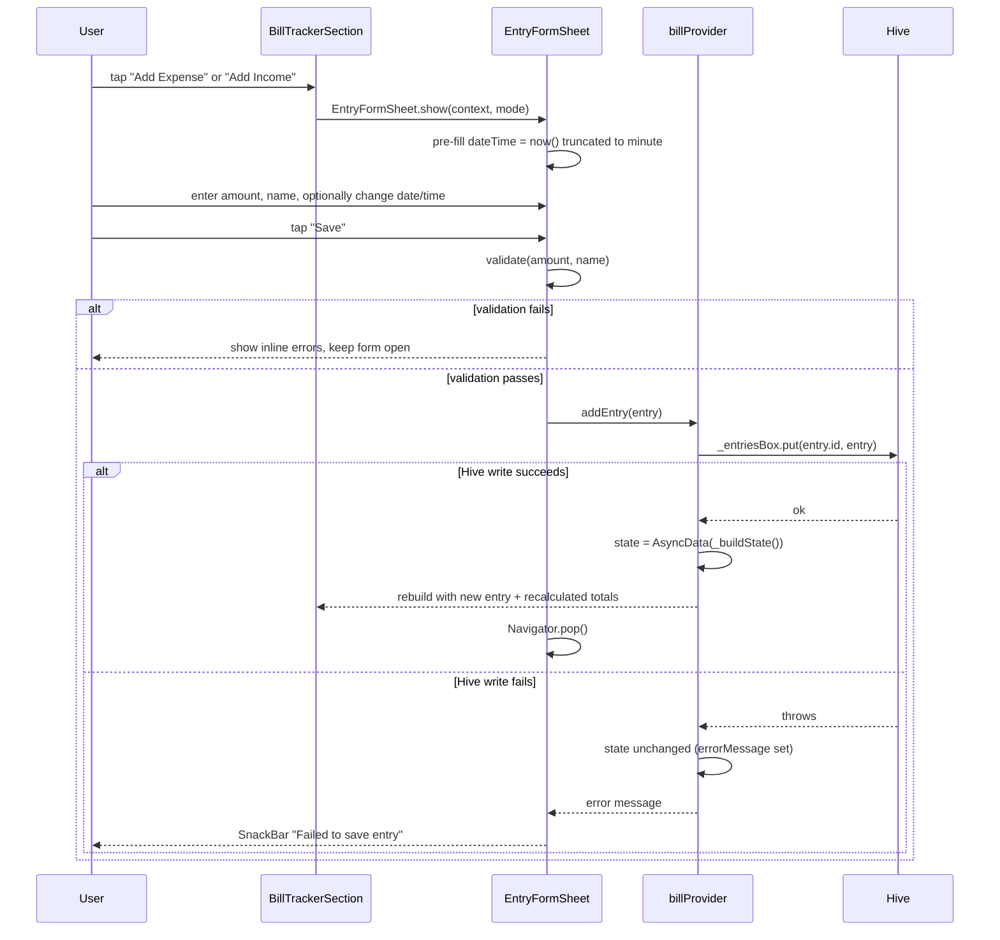

# Design Document: Bill Tracker

## Overview

The Bill Tracker extends the existing Ploy app by adding a personal finance section ("Bill") alongside the existing "Splitter" section. A two-tab toggle replaces the "Bill Splitter" heading in `HomeScreen`'s `_TopBar`, switching between the Bill tab (new) and the Splitter tab (existing, unchanged). The Bill tab renders a self-contained section for logging individual expense and income entries, viewing running totals, resetting either category to history, and browsing archived history batches.

All state is managed by a dedicated Riverpod `AsyncNotifier` (`billProvider`) backed by two Hive boxes (`bill_entries`, `bill_history`), fully independent of the existing Splitter providers. The feature follows established codebase patterns: `@HiveType`/`@HiveField` models with `.g.dart` generated files, `riverpod_annotation` code-generated providers, `ConsumerWidget` / `ConsumerStatefulWidget` screens, `AppTheme` constants, and the `FadeSlide`/`BounceTap` animation widgets.

The Splitter section is never modified; it is the fallback render when the "Splitter" tab is active. Tab state is local UI state in `HomeScreen` — not a provider — since it is pure rendering choice with no persistence requirement.

---

## Architecture



---

## Sequence Diagrams

### App Startup — Register Adapters, Open Boxes, Load & Auto-Purge



### Add Entry Flow



### Reset Category Flow

```mermaid
sequenceDiagram
    participant User
    participant BTS as BillTrackerSection
    participant BP as billProvider
    participant Hive

    User->>BTS: tap "Reset Expenses"
    BTS->>BTS: showDialog(confirmation)
    User->>BTS: tap "Confirm"
    BTS->>BP: resetExpenses()
    BP->>BP: create HistoryBatch(type: expense, entries: snapshot, resetAt: utcNow)
    BP->>Hive: _historyBox.put(batch.id, batch)
    alt historyBox.put succeeds
        BP->>Hive: delete all expense entry keys from _entriesBox
        alt _entriesBox deletes succeed
            Hive-->>BP: ok
            BP->>BP: state = AsyncData(BillState(expenses: [], totalExpense: 0.0, ...))
            BP-->>BTS: rebuild — Total Expenses shows ₹0.00
        else _entriesBox deletes fail
            BP->>Hive: rollback — _historyBox.delete(batch.id)
            BP->>BP: state unchanged; errorMessage set
            BP-->>BTS: SnackBar error
        end
    else historyBox.put fails
        BP->>BP: state unchanged; errorMessage set
        BP-->>BTS: SnackBar error
    end
    Note over BP: Income list, totalIncome, income history — untouched
```

---

## File Structure

### New Files

```
lib/
├── models/
│   ├── bill_entry.dart            # BillEntryType enum (typeId 4) + BillEntry model (typeId 5)
│   ├── bill_entry.g.dart          # generated by build_runner
│   ├── history_batch.dart         # HistoryBatch model (typeId 6)
│   └── history_batch.g.dart       # generated by build_runner
├── providers/
│   ├── bill_provider.dart         # BillState + Bill AsyncNotifier
│   └── bill_provider.g.dart       # generated by build_runner
├── screens/
│   └── bill_history_screen.dart   # Full-screen Bill History list
└── widgets/
    ├── bill_tracker_section.dart  # Root widget rendered under "Bill" tab
    ├── entry_form_sheet.dart      # Modal bottom sheet for adding entries
    └── summary_card.dart          # Reusable expense/income total card
```

### Modified Files

```
lib/main.dart                      # Register 3 new adapters, open 2 new Hive boxes
lib/screens/home_screen.dart       # Convert to ConsumerStatefulWidget, add _TabToggle
lib/app.dart                       # Add /bill-history route
```

---

## Data Models

### BillEntryType and BillEntry (`lib/models/bill_entry.dart`)

The enum and the entry class live in the same file so the generated adapter file (`bill_entry.g.dart`) covers both.

```dart
import 'package:hive/hive.dart';
import 'package:uuid/uuid.dart';

part 'bill_entry.g.dart';

/// Discriminates between an expense entry and an income entry.
/// typeId: 4 — registered as BillEntryTypeAdapter in main.dart.
@HiveType(typeId: 4)
enum BillEntryType {
  @HiveField(0)
  expense,
  @HiveField(1)
  income,
}

/// A single personal-finance record.
/// Stored in the 'bill_entries' Hive box, keyed by [id].
/// typeId: 5 — registered as BillEntryAdapter in main.dart.
@HiveType(typeId: 5)
class BillEntry extends HiveObject {
  @HiveField(0)
  final String id;

  @HiveField(1)
  final BillEntryType type;    // expense | income

  @HiveField(2)
  final double amount;         // always positive; 0.01 – 999_999_999.99

  @HiveField(3)
  final String name;           // product name (expense) or source name (income); 1–100 chars

  @HiveField(4)
  final DateTime dateTime;     // user-selected date + time

  BillEntry({
    String? id,
    required this.type,
    required this.amount,
    required this.name,
    DateTime? dateTime,
  })  : id = id ?? const Uuid().v4(),
        dateTime = dateTime ?? DateTime.now();
}
```

**Validation rules** (enforced in `EntryFormSheet` before calling the provider):

| Field      | Rule                                          | Error message                                     |
| ---------- | --------------------------------------------- | ------------------------------------------------- |
| `amount`   | `0.01 ≤ amount ≤ 999_999_999.99`              | "Enter an amount between 0.01 and 999,999,999.99" |
| `name`     | `1 ≤ name.trim().length ≤ 100`                | "Name must be 1–100 characters"                   |
| `dateTime` | any valid DateTime (pre-filled, always valid) | n/a                                               |

**Hive typeId assignments (full project table):**

| Adapter class          | typeId | Status   |
| ---------------------- | ------ | -------- |
| `PersonAdapter`        | 0      | existing |
| `ExpenseAdapter`       | 1      | existing |
| `SplitSessionAdapter`  | 2      | existing |
| _(reserved)_           | 3      | —        |
| `BillEntryTypeAdapter` | 4      | **new**  |
| `BillEntryAdapter`     | 5      | **new**  |
| `HistoryBatchAdapter`  | 6      | **new**  |

---

### HistoryBatch (`lib/models/history_batch.dart`)

```dart
import 'package:hive/hive.dart';
import 'package:uuid/uuid.dart';
import 'bill_entry.dart';

part 'history_batch.g.dart';

/// A snapshot of reset entries stored in the 'bill_history' Hive box.
/// Auto-purged when [resetAt] is >20 calendar days before the current device date.
/// typeId: 6 — registered as HistoryBatchAdapter in main.dart.
@HiveType(typeId: 6)
class HistoryBatch extends HiveObject {
  @HiveField(0)
  final String id;

  @HiveField(1)
  final BillEntryType type;       // expense | income batch

  @HiveField(2)
  final List<BillEntry> entries;  // deep snapshot of entries at reset time

  @HiveField(3)
  final DateTime resetAt;         // UTC timestamp of the reset action

  HistoryBatch({
    String? id,
    required this.type,
    required this.entries,
    DateTime? resetAt,
  })  : id = id ?? const Uuid().v4(),
        resetAt = resetAt ?? DateTime.now().toUtc();

  double get totalAmount => entries.fold(0.0, (sum, e) => sum + e.amount);
  int get entryCount => entries.length;
}
```

---

## Provider API (`lib/providers/bill_provider.dart`)

### BillState (immutable value object)

```dart
/// Immutable snapshot of all Bill Tracker state.
/// Exposed to the UI via ref.watch(billProvider).
@immutable
class BillState {
  final List<BillEntry> expenses;      // active expense entries, newest-first
  final List<BillEntry> incomes;       // active income entries, newest-first
  final List<HistoryBatch> history;    // all history batches, newest-first
  final double totalExpense;           // sum of expenses[*].amount
  final double totalIncome;            // sum of incomes[*].amount
  final String? errorMessage;          // non-null when a Hive operation failed

  const BillState({
    this.expenses = const [],
    this.incomes = const [],
    this.history = const [],
    this.totalExpense = 0.0,
    this.totalIncome = 0.0,
    this.errorMessage,
  });

  BillState copyWith({
    List<BillEntry>? expenses,
    List<BillEntry>? incomes,
    List<HistoryBatch>? history,
    double? totalExpense,
    double? totalIncome,
    String? errorMessage,
  }) =>
      BillState(
        expenses: expenses ?? this.expenses,
        incomes: incomes ?? this.incomes,
        history: history ?? this.history,
        totalExpense: totalExpense ?? this.totalExpense,
        totalIncome: totalIncome ?? this.totalIncome,
        errorMessage: errorMessage,   // null clears the error
      );
}
```

### Bill AsyncNotifier — Full Signature

```dart
part 'bill_provider.g.dart';

@riverpod
class Bill extends _$Bill {
  late Box<BillEntry> _entriesBox;
  late Box<HistoryBatch> _historyBox;

  /// Opens Hive boxes, runs auto-purge, loads initial state.
  /// Subscribes to box watch events for reactive updates.
  @override
  Future<BillState> build() async {
    _entriesBox = Hive.box<BillEntry>('bill_entries');
    _historyBox = Hive.box<HistoryBatch>('bill_history');

    await _purgeOldBatches();

    // Subscribe to external changes (e.g. from other isolates, though unlikely).
    final sub = _entriesBox.watch().listen((_) => _refresh());
    ref.onDispose(sub.cancel);

    return _buildState();
  }

  /// Add an expense or income entry.
  /// On success: emits new BillState with updated list + recalculated total.
  /// On failure: state unchanged; errorMessage set; throws so caller can show snackbar.
  Future<void> addEntry(BillEntry entry) async {
    try {
      await _entriesBox.put(entry.id, entry);
      _refresh();
    } catch (e) {
      _setError('Failed to save entry: $e');
      rethrow;
    }
  }

  /// Move all active expense entries to a HistoryBatch, then clear them.
  /// No-op if expense list is empty.
  /// Atomic: if either Hive write fails, state is left unchanged.
  Future<void> resetExpenses() async {
    final current = state.valueOrNull;
    if (current == null || current.expenses.isEmpty) return;

    final batch = HistoryBatch(
      type: BillEntryType.expense,
      entries: List.unmodifiable(current.expenses),
      resetAt: DateTime.now().toUtc(),
    );

    try {
      await _historyBox.put(batch.id, batch);
      try {
        for (final e in current.expenses) {
          await _entriesBox.delete(e.id);
        }
      } catch (e) {
        // Rollback history write if entry deletes fail.
        await _historyBox.delete(batch.id);
        rethrow;
      }
      _refresh();
    } catch (e) {
      _setError('Failed to reset expenses: $e');
      rethrow;
    }
  }

  /// Move all active income entries to a HistoryBatch, then clear them.
  /// No-op if income list is empty.
  /// Atomic: if either Hive write fails, state is left unchanged.
  Future<void> resetIncomes() async {
    final current = state.valueOrNull;
    if (current == null || current.incomes.isEmpty) return;

    final batch = HistoryBatch(
      type: BillEntryType.income,
      entries: List.unmodifiable(current.incomes),
      resetAt: DateTime.now().toUtc(),
    );

    try {
      await _historyBox.put(batch.id, batch);
      try {
        for (final e in current.incomes) {
          await _entriesBox.delete(e.id);
        }
      } catch (e) {
        await _historyBox.delete(batch.id);
        rethrow;
      }
      _refresh();
    } catch (e) {
      _setError('Failed to reset income: $e');
      rethrow;
    }
  }

  // ── Private helpers ───────────────────────────────────────────────────────

  /// Delete history batches whose resetAt (date-only) is >20 calendar days ago.
  /// Errors per-batch are logged and skipped; other batches continue to be evaluated.
  Future<void> _purgeOldBatches() async {
    final today = _dateOnly(DateTime.now());
    for (final batch in List.of(_historyBox.values)) {
      final resetDay = _dateOnly(batch.resetAt.toLocal());
      final diff = today.difference(resetDay).inDays;
      if (diff > 20) {
        try {
          await _historyBox.delete(batch.id);
        } catch (e) {
          // Log and continue — do not abort remaining purge or block startup.
          debugPrint('BillProvider: purge failed for batch ${batch.id}: $e');
        }
      }
    }
  }

  /// Reconstruct BillState from current box contents.
  BillState _buildState() {
    final allEntries = _entriesBox.values.toList()
      ..sort((a, b) => b.dateTime.compareTo(a.dateTime));

    final expenses = allEntries.where((e) => e.type == BillEntryType.expense).toList();
    final incomes = allEntries.where((e) => e.type == BillEntryType.income).toList();

    final history = _historyBox.values.toList()
      ..sort((a, b) => b.resetAt.compareTo(a.resetAt));

    return BillState(
      expenses: expenses,
      incomes: incomes,
      history: history,
      totalExpense: _total(expenses),
      totalIncome: _total(incomes),
    );
  }

  void _refresh() => state = AsyncData(_buildState());

  void _setError(String msg) {
    final current = state.valueOrNull ?? const BillState();
    state = AsyncData(current.copyWith(errorMessage: msg));
  }

  double _total(List<BillEntry> entries) =>
      entries.fold(0.0, (sum, e) => sum + e.amount);

  /// Returns a DateTime with only year/month/day (no time component).
  DateTime _dateOnly(DateTime dt) => DateTime(dt.year, dt.month, dt.day);
}
```

### State Transitions

| Action                 | Pre-condition                  | Post-condition                                                    |
| ---------------------- | ------------------------------ | ----------------------------------------------------------------- |
| `addEntry(expense)`    | any                            | `expenses` contains new entry; `totalExpense` recalculated        |
| `addEntry(income)`     | any                            | `incomes` contains new entry; `totalIncome` recalculated          |
| `resetExpenses()`      | `expenses.isNotEmpty`          | `expenses = []`, `totalExpense = 0.0`, new batch in `history`     |
| `resetIncomes()`       | `incomes.isNotEmpty`           | `incomes = []`, `totalIncome = 0.0`, new batch in `history`       |
| Any Hive write failure | any write                      | state unchanged; `errorMessage` set; exception rethrown to caller |
| `_purgeOldBatches()`   | cold start (before first emit) | batches with `daysDiff > 20` removed from `_historyBox`           |

---

## Auto-Purge Algorithm

```pascal
PROCEDURE _purgeOldBatches
  today ← DateOnly(DateTime.now())

  FOR each batch IN List.of(_historyBox.values) DO
    resetDay ← DateOnly(batch.resetAt.toLocal())
    daysDiff ← today.difference(resetDay).inDays

    IF daysDiff > 20 THEN
      TRY
        AWAIT _historyBox.delete(batch.id)
      CATCH error
        debugPrint('purge failed for ${batch.id}: $error')
        // continue — do not abort remaining purges
      END TRY
    END IF
  END FOR
END PROCEDURE
```

**Key invariants:**

- Comparison uses **date-only** — time-of-day is ignored. A batch reset at 23:59 on day D is treated as "day D".
- Purge runs **once per cold start**, before the provider emits its first `AsyncData`.
- Active `BillEntry` objects in `bill_entries` are **never touched** by purge logic.
- Per-batch errors are logged and skipped; remaining batches are still evaluated.
- A snapshot (`List.of(...)`) of batch values is iterated so box mutations during the loop do not cause concurrent modification errors.

---

## Components and Interfaces

### `_TabToggle` (private widget inside `lib/screens/home_screen.dart`)

**Purpose**: Replaces the `Text('Bill Splitter')` widget inside `_TopBar`. Stateless — receives active tab and a change callback from `HomeScreen`.

```dart
enum _BillTab { bill, splitter }

class _TabToggle extends StatelessWidget {
  final _BillTab activeTab;
  final ValueChanged<_BillTab> onTabChanged;

  const _TabToggle({
    required this.activeTab,
    required this.onTabChanged,
  });

  @override
  Widget build(BuildContext context) {
    return Row(
      mainAxisSize: MainAxisSize.min,
      children: [
        _TabLabel(
          label: 'Bill',
          isActive: activeTab == _BillTab.bill,
          onTap: () => onTabChanged(_BillTab.bill),
        ),
        Text(
          ' | ',
          style: Theme.of(context).textTheme.headlineMedium?.copyWith(
            color: AppTheme.textSecondary,
            fontWeight: FontWeight.bold,
          ),
        ),
        _TabLabel(
          label: 'Splitter',
          isActive: activeTab == _BillTab.splitter,
          onTap: () => onTabChanged(_BillTab.splitter),
        ),
      ],
    );
  }
}

class _TabLabel extends StatelessWidget {
  final String label;
  final bool isActive;
  final VoidCallback onTap;

  const _TabLabel({
    required this.label,
    required this.isActive,
    required this.onTap,
  });

  @override
  Widget build(BuildContext context) {
    // ConstrainedBox ensures minimum 44×44 tap target (accessibility).
    return ConstrainedBox(
      constraints: const BoxConstraints(minWidth: 44, minHeight: 44),
      child: GestureDetector(
        onTap: onTap,
        behavior: HitTestBehavior.opaque,
        child: Align(
          alignment: Alignment.centerLeft,
          child: Text(
            label,
            style: Theme.of(context).textTheme.headlineMedium?.copyWith(
              fontWeight: FontWeight.bold,
              color: isActive ? AppTheme.textPrimary : AppTheme.textSecondary,
              height: 1.1,
            ),
          ),
        ),
      ),
    );
  }
}
```

**HomeScreen conversion** — from `ConsumerWidget` to `ConsumerStatefulWidget`:

```dart
class HomeScreen extends ConsumerStatefulWidget {
  const HomeScreen({super.key});
  @override
  ConsumerState<HomeScreen> createState() => _HomeScreenState();
}

class _HomeScreenState extends ConsumerState<HomeScreen> {
  _BillTab _activeTab = _BillTab.bill;   // default: Bill tab on first launch

  @override
  Widget build(BuildContext context) {
    // ...
    return Scaffold(
      backgroundColor: AppTheme.primaryBg,
      // FAB only shown on Splitter tab
      floatingActionButton: _activeTab == _BillTab.splitter
          ? FloatingActionButton.extended(
              onPressed: () => context.push('/split-now'),
              backgroundColor: AppTheme.accentWarm,
              foregroundColor: AppTheme.primaryBg,
              icon: const Icon(Icons.add_rounded),
              label: const Text('New Split',
                  style: TextStyle(fontWeight: FontWeight.bold)),
            )
          : null,
      body: SafeArea(
        child: ListView(
          padding: const EdgeInsets.symmetric(horizontal: 20),
          children: [
            const SizedBox(height: 16),
            FadeSlide(
              delay: _d0,
              child: _TopBar(
                profile: profile,
                onAvatarTap: () => _openProfile(context),
                activeTab: _activeTab,
                onTabChanged: (tab) => setState(() => _activeTab = tab),
              ),
            ),
            const SizedBox(height: 28),
            if (_activeTab == _BillTab.bill)
              const FadeSlide(delay: _d1, child: BillTrackerSection())
            else ...[
              // existing Splitter widgets — unchanged
              FadeSlide(delay: _d1, child: _ActiveBillCard(...)),
              // ...
            ],
          ],
        ),
      ),
    );
  }
}
```

`_TopBar` receives two new parameters (`activeTab`, `onTabChanged`) and replaces `Text('Bill Splitter')` with `_TabToggle(activeTab: activeTab, onTabChanged: onTabChanged)`.

---

### `BillTrackerSection` (`lib/widgets/bill_tracker_section.dart`)

**Purpose**: Root `ConsumerWidget` for the Bill tab. Watches `billProvider`, handles all three `AsyncValue` states (loading / error / data), and composes the full Bill UI.

```dart
class BillTrackerSection extends ConsumerWidget {
  const BillTrackerSection({super.key});

  @override
  Widget build(BuildContext context, WidgetRef ref) {
    final asyncState = ref.watch(billProvider);
    return asyncState.when(
      loading: () => const Center(child: CircularProgressIndicator()),
      error: (err, _) => _ErrorPlaceholder(message: err.toString()),
      data: (state) => _BillContent(state: state, ref: ref),
    );
  }
}
```

**Widget tree (data state):**

```
BillTrackerSection (ConsumerWidget)
└── AsyncValue.when
    ├── loading  → Center(CircularProgressIndicator)
    ├── error    → _ErrorPlaceholder(message)
    └── data     → _BillContent
        └── Column (inside parent ListView)
            ├── Row                              ← summary cards
            │   ├── Expanded → SummaryCard(
            │   │     label: 'Total Expenses',
            │   │     amount: state.totalExpense,
            │   │     accentColor: Colors.redAccent,
            │   │     icon: Icons.arrow_downward_rounded,
            │   │   )
            │   ├── SizedBox(width: 12)
            │   └── Expanded → SummaryCard(
            │         label: 'Total Income',
            │         amount: state.totalIncome,
            │         accentColor: AppTheme.accentWarm,
            │         icon: Icons.arrow_upward_rounded,
            │       )
            ├── SizedBox(height: 24)
            ├── _SectionHeader(
            │     title: 'Expenses',
            │     onAdd: () => EntryFormSheet.show(ctx, EntryFormMode.expense),
            │     onReset: state.expenses.isNotEmpty ? resetExpenses : null,
            │   )
            ├── state.expenses.isEmpty
            │   ? _EmptyPlaceholder('No expenses yet')
            │   : _EntryList(entries: state.expenses, type: expense)
            ├── SizedBox(height: 20)
            ├── _SectionHeader(
            │     title: 'Income',
            │     onAdd: () => EntryFormSheet.show(ctx, EntryFormMode.income),
            │     onReset: state.incomes.isNotEmpty ? resetIncomes : null,
            │   )
            ├── state.incomes.isEmpty
            │   ? _EmptyPlaceholder('No income yet')
            │   : _EntryList(entries: state.incomes, type: income)
            ├── SizedBox(height: 20)
            └── _HistoryButton → context.push('/bill-history')
```

`_EntryList` renders a `ListView.builder` (or a `Column` of items when embedded in a parent `ListView`) with each item wrapped in `FadeSlide` for entrance animation. Each `_EntryTile` shows: icon (downward red or upward warm), entry name, `₹X.XX` amount, and formatted date-time.

`_SectionHeader` displays the section title plus:

- An "Add" icon button (always enabled) → opens `EntryFormSheet`
- A "Reset" text button → disabled (greyed out) when `onReset` is null

---

### `SummaryCard` (`lib/widgets/summary_card.dart`)

**Purpose**: Reusable card for displaying `Total_Expense` or `Total_Income`.

```dart
class SummaryCard extends StatelessWidget {
  final String label;         // "Total Expenses" | "Total Income"
  final double amount;        // numeric total
  final Color accentColor;    // Colors.redAccent | AppTheme.accentWarm
  final IconData icon;        // Icons.arrow_downward_rounded | Icons.arrow_upward_rounded

  const SummaryCard({
    required this.label,
    required this.amount,
    required this.accentColor,
    required this.icon,
    super.key,
  });

  @override
  Widget build(BuildContext context) {
    return Container(
      padding: const EdgeInsets.all(20),
      decoration: BoxDecoration(
        color: AppTheme.surface,
        borderRadius: BorderRadius.circular(AppTheme.cardRadius), // 20
      ),
      child: Column(
        crossAxisAlignment: CrossAxisAlignment.start,
        children: [
          Row(
            children: [
              Icon(icon, color: accentColor, size: 18),
              const SizedBox(width: 6),
              Text(label, style: /* bodySmall, textSecondary */),
            ],
          ),
          const SizedBox(height: 8),
          Text(
            '₹${amount.toStringAsFixed(2)}',
            style: /* titleLarge, bold, textPrimary */,
          ),
        ],
      ),
    );
  }
}
```

---

### `EntryFormSheet` (`lib/widgets/entry_form_sheet.dart`)

**Purpose**: Modal bottom sheet for adding an expense or income entry. `ConsumerStatefulWidget` so it can hold form controllers and call the provider.

```dart
enum EntryFormMode { expense, income }

class EntryFormSheet extends ConsumerStatefulWidget {
  final EntryFormMode mode;

  const EntryFormSheet({required this.mode, super.key});

  /// Convenience launcher used by BillTrackerSection.
  static Future<void> show(BuildContext context, EntryFormMode mode) =>
      showModalBottomSheet(
        context: context,
        isScrollControlled: true,
        backgroundColor: Colors.transparent,
        builder: (_) => EntryFormSheet(mode: mode),
      );
}
```

**Internal state** (in `ConsumerState<EntryFormSheet>`):

```pascal
STRUCTURE _FormState
  _amountController : TextEditingController  // initialized to ''
  _nameController   : TextEditingController  // initialized to ''
  _selectedDateTime : DateTime               // DateTime.now() truncated to minute
  _amountError      : String?
  _nameError        : String?
  _isSubmitting     : bool = false
END STRUCTURE
```

**Widget tree:**

```
EntryFormSheet (modal bottom sheet)
└── DraggableScrollableSheet / Padding(bottom: MediaQuery.viewInsets.bottom)
    └── Container (surface, borderRadius top 24)
        └── Column
            ├── Handle bar
            ├── Text title: mode == expense ? 'Add Expense' : 'Add Income'
            ├── SizedBox(height: 20)
            ├── TextFormField — amount (keyboardType: decimal, controller: _amountController)
            │     errorText: _amountError
            ├── SizedBox(height: 16)
            ├── TextFormField — name/source (controller: _nameController)
            │     label: mode == expense ? 'Product / Item name' : 'Income source'
            │     errorText: _nameError
            ├── SizedBox(height: 16)
            ├── _DateTimePicker(value: _selectedDateTime, onChanged: ...)
            ├── SizedBox(height: 24)
            └── ElevatedButton('Save', onPressed: _isSubmitting ? null : _submit)
```

**Submission algorithm:**

```pascal
PROCEDURE _submit(ref, context)
  _amountError ← null
  _nameError   ← null

  rawText ← _amountController.text.trim()
  parsed  ← double.tryParse(rawText)

  IF parsed IS null OR parsed < 0.01 OR parsed > 999_999_999.99 THEN
    _amountError ← "Enter an amount between 0.01 and 999,999,999.99"
  END IF

  name ← _nameController.text.trim()
  IF name.isEmpty OR name.length > 100 THEN
    _nameError ← "Name must be 1–100 characters"
  END IF

  IF _amountError IS NOT null OR _nameError IS NOT null THEN
    setState()   // re-render with inline errors; keep form open; fields preserved
    RETURN
  END IF

  setState(_isSubmitting = true)

  entry ← BillEntry(
    type     = mode == expense ? BillEntryType.expense : BillEntryType.income,
    amount   = parsed,
    name     = name,
    dateTime = _selectedDateTime,
  )

  TRY
    AWAIT ref.read(billProvider.notifier).addEntry(entry)
    Navigator.pop(context)         // dismiss sheet on success
  CATCH error
    setState(_isSubmitting = false)
    ScaffoldMessenger.of(context).showSnackBar(
      SnackBar(content: Text('Failed to save entry. Please try again.'))
    )
  END TRY
END PROCEDURE
```

**Date-time picker**: `_DateTimePicker` widget calls `showDatePicker` then chains into `showTimePicker`. The returned combined `DateTime` updates `_selectedDateTime` via `setState`.

```pascal
PROCEDURE _pickDateTime(context)
  date ← AWAIT showDatePicker(
    initialDate: _selectedDateTime,
    firstDate: DateTime(2000),
    lastDate: DateTime(2100),
  )
  IF date IS null THEN RETURN

  time ← AWAIT showTimePicker(
    initialTime: TimeOfDay.fromDateTime(_selectedDateTime),
  )
  IF time IS null THEN RETURN

  setState(_selectedDateTime = DateTime(date.year, date.month, date.day, time.hour, time.minute))
END PROCEDURE
```

---

### `BillHistoryScreen` (`lib/screens/bill_history_screen.dart`)

**Purpose**: Full-screen read-only list of all `HistoryBatch` items, sorted newest-first. Route: `/bill-history`.

```dart
class BillHistoryScreen extends ConsumerWidget {
  const BillHistoryScreen({super.key});

  @override
  Widget build(BuildContext context, WidgetRef ref) {
    final asyncState = ref.watch(billProvider);
    return Scaffold(
      backgroundColor: AppTheme.primaryBg,
      appBar: AppBar(
        title: const Text('Bill History'),
        backgroundColor: AppTheme.primaryBg,
        foregroundColor: AppTheme.textPrimary,
        elevation: 0,
      ),
      body: asyncState.when(
        loading: () => const Center(child: CircularProgressIndicator()),
        error: (e, _) => Center(child: Text('Unable to load history')),
        data: (state) => state.history.isEmpty
            ? const Center(child: Text('No history yet'))
            : ListView.builder(
                padding: const EdgeInsets.all(20),
                itemCount: state.history.length,
                itemBuilder: (ctx, i) => FadeSlide(
                  delay: Duration(milliseconds: i * 60),
                  child: _BatchCard(batch: state.history[i]),
                ),
              ),
      ),
    );
  }
}
```

**`_BatchCard`** displays:

- Type chip: "Expense" (red-toned) or "Income" (accentWarm)
- Reset date: formatted as `dd MMM yyyy, HH:mm`
- Entry count: "N entries"
- Total amount: `₹X.XX`

---

## main.dart Changes

```dart
// New imports
import 'models/bill_entry.dart';
import 'models/history_batch.dart';

void main() async {
  WidgetsFlutterBinding.ensureInitialized();
  await Hive.initFlutter();

  // Existing adapters
  Hive.registerAdapter(PersonAdapter());       // typeId 0
  Hive.registerAdapter(ExpenseAdapter());      // typeId 1
  Hive.registerAdapter(SplitSessionAdapter()); // typeId 2

  // New Bill Tracker adapters
  Hive.registerAdapter(BillEntryTypeAdapter()); // typeId 4
  Hive.registerAdapter(BillEntryAdapter());     // typeId 5
  Hive.registerAdapter(HistoryBatchAdapter());  // typeId 6

  // Existing box
  await Hive.openBox<SplitSession>('sessions');

  // New Bill Tracker boxes
  await Hive.openBox<BillEntry>('bill_entries');
  await Hive.openBox<HistoryBatch>('bill_history');

  runApp(ProviderScope(child: PloyApp()));
}
```

---

## app.dart Changes (go_router)

Add a `/bill-history` route:

```dart
GoRoute(
  path: '/bill-history',
  builder: (context, state) => const BillHistoryScreen(),
),
```

---

## State Management Flow

```mermaid
sequenceDiagram
    participant W as ConsumerWidget
    participant P as billProvider (AsyncNotifier)
    participant H as Hive Boxes

    W->>P: ref.watch(billProvider)
    P-->>W: AsyncData(BillState) — initial render

    W->>P: ref.read(billProvider.notifier).addEntry(entry)
    P->>H: _entriesBox.put(entry.id, entry)
    H-->>P: success
    P->>P: _refresh() → state = AsyncData(_buildState())
    P-->>W: rebuild with updated expenses + totalExpense

    Note over P,H: On Hive write failure
    P->>P: state unchanged; errorMessage set
    P-->>W: rebuild → SnackBar shown by caller

    W->>P: ref.read(billProvider.notifier).resetExpenses()
    P->>H: _historyBox.put(batch)
    P->>H: _entriesBox.delete(expense keys)
    P->>P: _refresh()
    P-->>W: expenses: [], totalExpense: 0.0
```

**Independence guarantee**: `billProvider` reads/writes only `bill_entries` and `bill_history` boxes. It never reads or mutates `historyProvider`, `profileProvider`, or the `sessions` box. No Splitter widget watches `billProvider`. State mutations in either feature never cause rebuilds in the other.

---

## Error Handling

| Scenario                               | Trigger                         | Response                                                                              |
| -------------------------------------- | ------------------------------- | ------------------------------------------------------------------------------------- |
| Hive box open failure at startup       | `openBox()` throws              | Provider emits `AsyncError`; `BillTrackerSection` shows error placeholder; no crash   |
| `addEntry()` write failure             | `_entriesBox.put()` throws      | State unchanged; exception rethrown; SnackBar shown by `EntryFormSheet`               |
| `resetExpenses/Incomes()` failure      | Either `put` or `delete` throws | Rollback attempted (delete batch if entries-delete fails); state unchanged; SnackBar  |
| `_purgeOldBatches()` per-batch failure | `_historyBox.delete()` throws   | That batch preserved; `debugPrint` logged; remaining batches continue to be evaluated |
| History box read failure at startup    | during `build()`                | Provider emits `AsyncError`; `BillHistoryScreen` shows "Unable to load history"       |

---

## Testing Strategy

### Unit Testing Approach

Test `BillState.copyWith`, total calculation helpers (`_total`), and the auto-purge date arithmetic in isolation using plain Dart unit tests. Use `fake_async` or `clock` package for time-dependent tests.

### Property-Based Testing Approach

**Property Test Library**: `test` package with `glados` (or a compatible property-based testing library available in the project).

Property tests live in `test/bill_tracker/` directory.

**Properties to verify:**

1. **Total consistency** — `totalExpense` equals the fold-sum of all expense amounts; same for income.
2. **Round-trip persistence** — A `BillEntry` written to and read from a Hive box has all fields equal to the original.
3. **Reset expense isolation** — After `resetExpenses()`, income list and `totalIncome` are identical to pre-reset values.
4. **Reset income isolation** — After `resetIncomes()`, expense list and `totalExpense` are identical to pre-reset values.
5. **Auto-purge threshold** — Batches with `daysDiff > 20` are absent after `build()`; batches with `daysDiff ≤ 20` are present.
6. **Amount validation boundary** — Values in `[0.01, 999_999_999.99]` are valid; values outside are invalid.
7. **Name length boundary** — Names of length 1–100 are valid; length 0 or > 100 are invalid.

### Integration Testing Approach

Use `flutter_test` with `ProviderContainer` and an in-memory Hive configuration:

- Full `addEntry → _buildState → rebuild` cycle
- `resetExpenses` correctly writes batch and clears active expense list
- `_purgeOldBatches` removes only batches with `daysDiff > 20`
- Box open failure produces `AsyncError` (not a crash)

---

## Performance Considerations

- Both boxes are opened once at startup and kept open; no per-operation overhead.
- `_buildState()` iterates box values once per state update — O(n) on active entry count. With typical personal usage (tens to low hundreds of entries), this is negligible.
- History auto-purge is O(m) on batch count; runs once per cold start.
- `BillTrackerSection` only rebuilds when `billProvider` emits a new state — no cross-contamination with Splitter rebuilds.
- `FadeSlide` animations are fire-and-forget and use single `AnimationController` per item — no persistent render overhead after animation completes.

---

## Security Considerations

- All data is stored locally on-device via Hive; no financial data is transmitted over the network.
- No encryption is applied (consistent with existing Splitter storage); appropriate for a personal-use local app.
- Amount and name inputs are validated in both the form layer and the provider layer, preventing obviously malformed data from reaching Hive.

---

## Correctness Properties

### Property 1: Total Consistency

For any `BillState`, `totalExpense` equals the exact arithmetic sum of all amounts in `expenses`, and `totalIncome` equals the exact arithmetic sum of all amounts in `incomes`.

- `∀ state: state.totalExpense = state.expenses.fold(0.0, (s, e) => s + e.amount)`
- `∀ state: state.totalIncome  = state.incomes.fold(0.0, (s, e) => s + e.amount)`

**Validates: Requirements 2.1, 2.2, 9.1**

---

### Property 2: Round-Trip Persistence

For any `BillEntry` written to and read back from the `bill_entries` Hive box, every field (`id`, `type`, `amount`, `name`, `dateTime`) is equal to the original.

- `∀ entry: box.put(entry.id, entry) then box.get(entry.id) == entry` (field-wise)

**Validates: Requirements 8.5**

---

### Property 3: Reset Expense Isolation

After `resetExpenses()` completes successfully, the income list and `totalIncome` are identical to their values immediately before the call.

- `∀ state: after resetExpenses() → state'.incomes = state.incomes ∧ state'.totalIncome = state.totalIncome`

**Validates: Requirements 5.7**

---

### Property 4: Reset Income Isolation

After `resetIncomes()` completes successfully, the expense list and `totalExpense` are identical to their values immediately before the call.

- `∀ state: after resetIncomes() → state'.expenses = state.expenses ∧ state'.totalExpense = state.totalExpense`

**Validates: Requirements 6.7**

---

### Property 5: Auto-Purge Threshold

For any `HistoryBatch`, if `dateDiffDays(today, batch.resetAt.toLocal()) > 20` then the batch is absent from state after `build()` completes; if `≤ 20` it is present.

- `∀ batch: daysDiff > 20 → batch ∉ state.history after build()`
- `∀ batch: daysDiff ≤ 20 → batch ∈ state.history after build()`

**Validates: Requirements 7.3**

---

### Property 6: Amount Validation Boundary

The form accepts all amounts in the closed interval `[0.01, 999,999,999.99]` and rejects all amounts outside it.

- `∀ amount ∈ [0.01, 999_999_999.99]: validate(amount) = valid`
- `∀ amount ∉ [0.01, 999_999_999.99]: validate(amount) = invalid`

**Validates: Requirements 3.3, 4.3**

---

### Property 7: Name Length Boundary

The form accepts entry names of length 1–100 and rejects names of length 0 or length > 100.

- `∀ name: 1 ≤ name.trim().length ≤ 100 → validateName(name) = valid`
- `∀ name: name.trim().isEmpty ∨ name.trim().length > 100 → validateName(name) = invalid`

**Validates: Requirements 3.4, 4.4**

---

### Property 8: Non-Negative Totals

Since all stored amounts satisfy `amount ≥ 0.01`, both totals are always non-negative.

- `∀ state: state.totalExpense ≥ 0.0 ∧ state.totalIncome ≥ 0.0`

**Validates: Requirements 2.4, 2.5, 9.1**

---

### Property 9: History Batch Type Isolation

An expense reset never creates an income-typed `HistoryBatch`, and an income reset never creates an expense-typed `HistoryBatch`.

- `∀ call to resetExpenses(): new batch.type = BillEntryType.expense`
- `∀ call to resetIncomes(): new batch.type = BillEntryType.income`

**Validates: Requirements 5.3, 6.3**

---

### Property 10: State Atomicity on Reset Failure

If the combined reset operation (historyBox.put + entriesBox.delete) fails at any point, the resulting state is identical to the pre-reset state — no partial update is observable.

- `∀ failed reset: state' = state` (no entries removed AND no stale batch in history)

**Validates: Requirements 5.4, 6.4**

---

## Dependencies

All required packages are already present in the project. No new packages are needed.

| Package                 | Purpose                                                     |
| ----------------------- | ----------------------------------------------------------- |
| `hive` / `hive_flutter` | Persistent storage for entries and history batches          |
| `hive_generator`        | Code generation for `@HiveType` / `@HiveField` adapters     |
| `build_runner`          | Runs code generation to produce `.g.dart` files             |
| `riverpod_annotation`   | Code-generated `@riverpod` providers                        |
| `flutter_riverpod`      | `ConsumerWidget`, `ConsumerStatefulWidget`, `ProviderScope` |
| `uuid`                  | UUID generation for `BillEntry.id` and `HistoryBatch.id`    |
| `go_router`             | Navigation to `/bill-history` route                         |
| `google_fonts`          | Plus Jakarta Sans typography via `AppTheme`                 |
